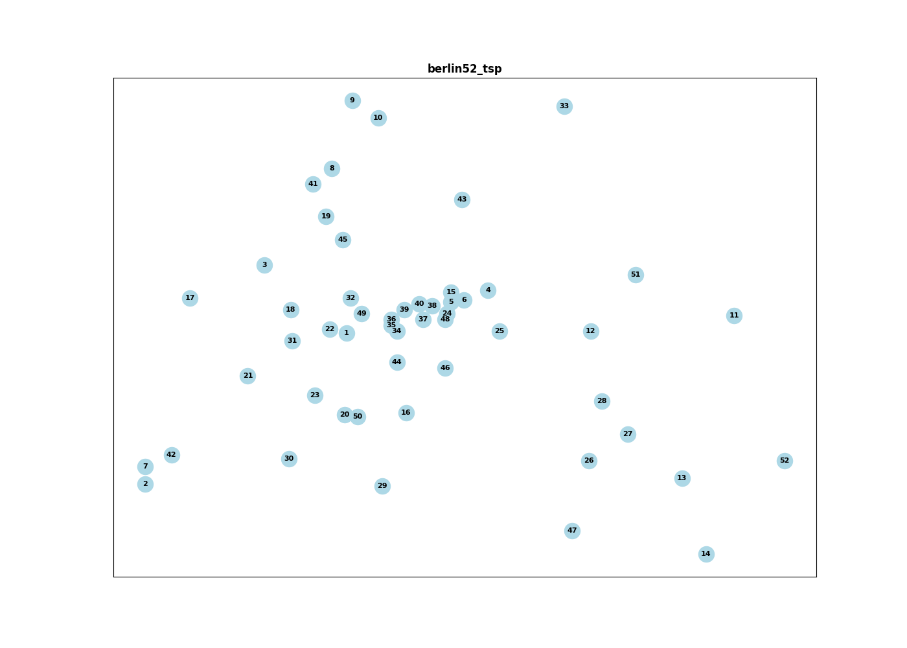

# TP2 Alg2 - Solutions for hard problems

This repository contains the Branch-And-Bound, Twice-around-the-tree and Christofides solvers for the Traveling Salesman Problem (TSP). The project includes functionalities for parsing TSP data, creating and manipulating graphs, making experiments and visualizing the results.

## Project Structure
```
.
├── test_data/
├── graphs/
├── plots/
├── results/
│   ├── final_results.csv
├── src/
│   ├── branch_and_bound.py
│   ├── graph.py
│   ├── main.py
│   └── utils.py
├── requirements.txt
```

## Requirements
The project requires the following Python packages:

- `networkx`
- `matplotlib`
- `numpy`
- `psutil`
- `pandas`

You can install the required packages using:

```sh
pip install -r requirements.txt
```

## Usage

### Parsing TSP Data
To get the TSP data as a graph, you can uncomment the line in ``main.py`` that saves the graphs into disk by calling the function ``save_graphs_into_disk``, this function will also save graph visualization images under the folder ``plots``. The graphs will then be saved in the ``graphs`` directory. After that you can comment this line again.

From that point on the graphs will be loaded from the ``graphs`` directory.

### Running the Solver
To run the solver, change this line in the ``main.py`` file:

```python
process = Process(target=branch_and_bound, args=(graph, 1, result_queue))
```
To use the desired algorithm on the `target` parameter. The options are:
- `branch_and_bound`: Branch-And-Bound
- `twice_around_the_tree`: Twice-around-the-tree
- `christofides`: Christofides

Then, run the following command:
```sh
python src/main.py
```

## Results
All the results of our experiments are saved in the `results` directory. With the aggregate results saved in the `final_results.csv` file.